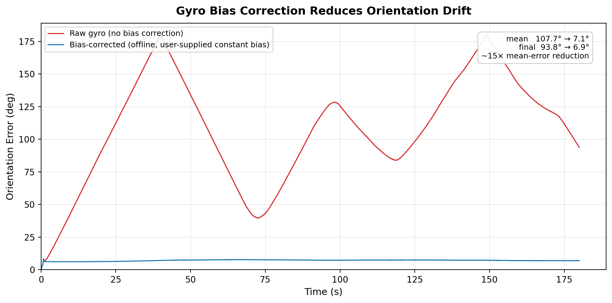

# slam-core

A geometry-first Visual-Inertial SLAM system built in disciplined stages, with
Rerun-based visual debugging and reproducible experiments on EuRoC MAV.



*Offline gyro bias correction on EuRoC MH_01_easy: mean gyro-only orientation
error over 180 s drops from ~108° to ~7°. Generated by the quickstart below.*

## Build and test

Requires CMake ≥ 3.24, a C++17 compiler, Eigen (3.4–5.x), and
[uv](https://docs.astral.sh/uv/) for the Python tooling.

```bash
git clone https://github.com/shaurya-p/slam-core.git
cd slam-core

# C++ library, tools, and tests (googletest is fetched automatically)
cmake -S . -B build -DCMAKE_BUILD_TYPE=Release
cmake --build build -j
ctest --test-dir build

# Python tooling and tests
uv sync
uv run pytest
```

## Reproduce the plot above

Download [EuRoC MAV](https://projects.asl.ethz.ch/datasets/doku.php?id=kmavvisualinertialdatasets)
`MH_01_easy` so it sits at `<dataset_root>/euroc/MH_01_easy/mav0/...`, then:

```bash
export SLAM_CORE_DATASETS=/path/to/datasets
IMU="$SLAM_CORE_DATASETS/euroc/MH_01_easy/mav0/imu0/data.csv"

# Raw and offline-bias-corrected gyro-only orientation propagation
./build/tools/export_gyro_propagation "$IMU" results/imu/MH_01_easy_gyro_orientations.csv
./build/tools/export_gyro_propagation "$IMU" results/imu/MH_01_easy_gyro_orientations_bias_corrected.csv \
  --gyro-bias -0.00332713 0.0212966 0.0780824

uv run python scripts/plots/plot_gyro_bias_impact.py \
  results/imu/MH_01_easy_gyro_orientations.csv \
  results/imu/MH_01_easy_gyro_orientations_bias_corrected.csv \
  --config configs/datasets/euroc_mh01.yaml \
  --output results/plots/MH_01_easy_gyro_bias_impact.png \
  --max-duration-s 180
```

The bias values are GT-derived by `./build/tools/evaluate_gyro_bias_from_gt`
(diagnostic only — the runtime system does not estimate bias online yet).

For interactive 3D inspection, the same CSVs feed the
[Rerun](https://rerun.io) scripts under `scripts/rerun/`:

```bash
uv run python scripts/rerun/rerun_euroc_gyro_propagation.py \
  configs/datasets/euroc_mh01.yaml \
  results/imu/MH_01_easy_gyro_orientations.csv \
  results/imu/MH_01_easy_gyro_orientations_bias_corrected.csv \
  --labels raw bias_corrected --frame-stride 5 --max-duration-s 180
rerun results/rerun/MH_01_easy_gyro_propagation.rrd
```

## Documentation

- [Architecture and conventions](docs/architecture.md)
- [Project status](docs/project_state.md) — what is implemented and what is next
- [Design decisions](docs/design_decisions.md)
- [EuRoC dataset setup](docs/datasets/euroc.md)
- [Benchmark plan](docs/benchmark_plan.md)
- [Failure atlas](docs/failure_atlas.md)

## License

[Apache-2.0](LICENSE)
